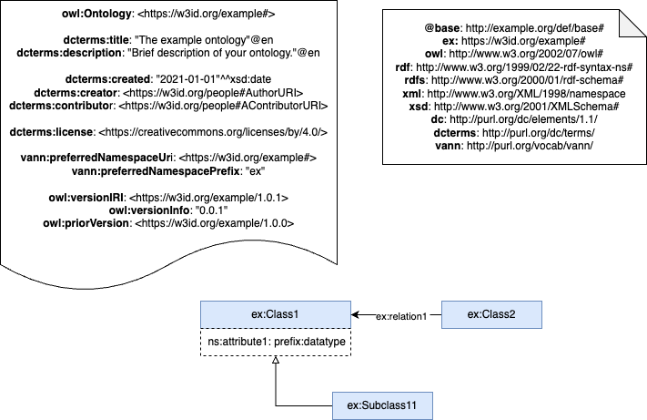

# Ontología XXX

La ontología XXX represent el dominio XXXX.

# Propósito y alcance de la ontología

El propósito de la ontología XXX es YYYY. 
El alcance de la ontología XXX está limitado a ZZZZ.

# Prefijo y espacio de nombres de la ontología

El prefijo de la ontología es: XXX y se encuentra publicada en el espacio de nombres: https://webdomain.ext/def/domain/subdomain# 

# Modelo conceptual de la ontología

Cada repositorio de desarrollo de ontologías debe incluir, en este README principal, una representación visual de la conceptualización de la ontología.
Esta imagen ayuda a los usuarios y colaboradores a comprender rápidamente la estructura de la ontología, sus conceptos clave y las relaciones entre ellos.

- La imagen debe estar ubicada en la carpeta de conceptualización.
- Formatos aceptados: .svg, .png o .drawio.
- Debe referenciarse en este README usando la sintaxis de Markdown, por ejemplo:

# Estructura del repositorio

El repositorio debe contener (al menos) las siguientes carpetas

| Carpeta | Descripción |
|--------|--------------|
| **diagrams/** | Contiene diagramas y otros recursos que representan el modelo conceptual de la ontología (por ejemplo, jerarquías de clases, relaciones). |
| **documentation/** | Contiene la documentación de la ontología y artefactos relacionados en formato HTML o dirigida a usuarios. |
| **tests/** | Contiene las pruebas para la evaluación de la ontología. |
| **kos/** | Contiene la implementación de vocabularios controlados o KOS, generalmente implementaciones SKOS en RDF.|
| **ontology/** | Contiene los archivos de implementación de la ontología en formatos como .owl, .rdf, .ttl o .jsonld |
| **requirements/** | Contiene todos los documentos utilizados para definir los requisitos de la ontología: ejemplos de datos, preguntas de competencia, requisitos funcionales, casos de uso, etc. |
| **shapes/** | Contiene las restricciones SHACL utilizad para validar datos respecto a la ontología.  |

# Mantenimiento del proyecto

Para gestionar esos incidentes o las mejoras sugeridas con respecto a la ontología, recomendamos seguir las guías proporcionadas en [Issues Management](https://github.com/nombre-repositorio/wiki/issues-management) para generar incidecias (trabajo en progreso).

# Financiación

Incluir aquí la información sobre financiación del proyecto e imágenes necesarias.
